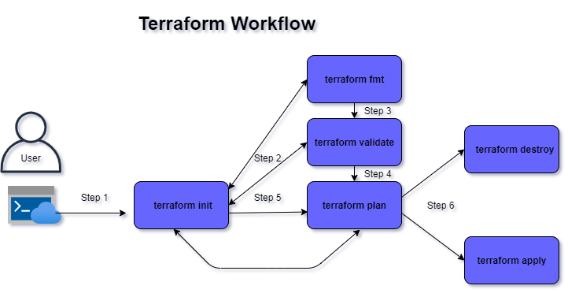

# Terraform workflow

- 

## initialization
- After creating the basic terraform seetings/provider block for respective provider to build the infrastucture. Terraform need to initialize a working directory containing Terraform configuration files.
- It will be the first command that we have to execute once/multiple times after writing the terraform configuration files (.tf files).
- It is always recommended to run multiple times, as it will bring the working directory up to date with the changes.
- ```terraform init``` command creates directory named with ```.terraform```.
- Until Terraform 0.12 and earlier we used to use provider block to declare provider plugin version to install on local system which helps terraform run API calls to create resources on the provider.
```
# Snippet for provider block:
# Configure the AWS Provider
provider "aws" {
  version = "~> 3.0"
  region  = "us-east-1"
}

# terraform settings block from terraform version 0.13
terraform {
  required_providers {
    aws = {
      source  = "hashicorp/aws"
      version = "~> 3.0"
    }
  }
}

# Configure the AWS Provider
provider "aws" {
  region = "us-east-1"
}
```
### Terraform Authentication against the provider
- Static credentials (Not recommended by Terraform)
- Environment variables
- Shared credentials/configuration files

## Format and Validate terraform files
- its recommended to use consistent formatting as per best practices.
```
terraform fmt
```
- it automatically updates all configuration files under the working directory for readability and consistency.
- command displays the output of the files which has been formatting while executing the command.
- we can check configuration files are syntactically valid and internally consistent.
```
terraform validate
```

## Planning
- Terraform shows an execution plan before actual resources created, as a preview to check if it is expected or not and do necessary changes in the configuration files.
```
terraform plan
```
- The plan represents the changes that Terraform needs to make to infrastructure to reach the desired state represented by the configuration.
- terraform plan command can be execute after corrections made in our configuration files if needed and see it shows expected results.
- we can execute command before creation, destory, up-date.
- Reading the current state of any already-existing remote objects to make sure that the Terraform state is up-to-date.
- Comparing the current configuration to the prior state and noting any differences.

## apply
- After successful plan command ```terraform plan```, we can create a resource by executing ```terraform apply [-auto-approve]``.
- It will make your infrastructure ready as per the desired configuration files(.tf).
- To override argument values if any, we can passing command line arguments while executing ```terraform apply -var=<>```.

## destroy
- Inorder to delete the resource on the target provider.
- ```terraform destroy [-auto-approve]``` command will remove all the resources that are create on the target provider.

## cleanup
- Manually remove all files and directory in that workspace to recreate the resource from scratch.
- files and directories that needs to be removed:
```
rm -rf .terraform                    --> which stores provider plugins
rm -rf terraform.tfstate            --> current state of the target provider
rm -rf terraform.tftstate.backup
rm -rf terraform.tfstate.d          --> To store multiple state files, which works well for backend
or
rm -rf .terraform* terraform*
```

### References:
- [Initialize working directory](https://www.terraform.io/docs/cli/init/index.html)
- [Provisioning Infrastucture](https://www.terraform.io/docs/cli/run/index.html)